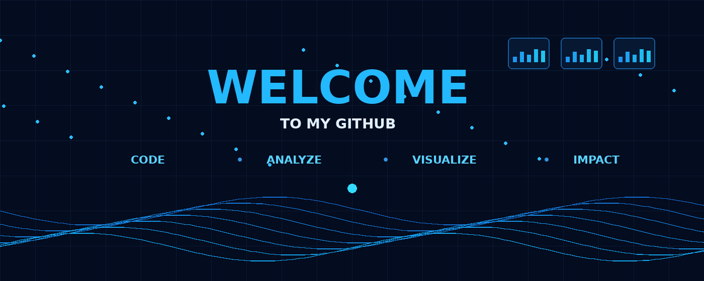

  

  

## About Me

Hi, I'm **Krishna Vamsi**, a Software Engineer and M.Sc. Scientific Instrumentation student at Ernst-Abbe-Hochschule Jena, Germany.

I have **4+ years of professional experience in software development and business process automation using PEGA PRPC**. Currently, I am expanding my expertise in **Data Analytics and Business Intelligence**, with a focus on Python, SQL, Power BI, and Excel.

### 💼 Professional Experience
- 4+ years of experience in PEGA PRPC and enterprise application development
- Business requirements and process analysis
- Workflow automation and process improvement
- Reporting, dashboards, and data validation
- REST/SOAP integrations and database interaction

### 📊 Data Analytics Skills
- **Python:** Pandas, NumPy
- **SQL:** SQL Server, PostgreSQL
- **Business Intelligence:** Power BI, DAX, Data Modeling
- **Microsoft Office:** Excel, PowerPoint
- **Tools:** Git, GitHub, VS Code

### 🚀 Featured Project

**QuickBite Restaurant Analytics**

An end-to-end restaurant analytics project covering:
- 5K customers
- 100K orders
- 603K order items
- 150 employees
- 10 stores
- €3.31M revenue

Built using **Python, Pandas, SQL Server, Power BI, and DAX**, including data generation, SQL analysis, data modeling, and four interactive Power BI dashboards.

### 🎯 Currently
- Pursuing M.Sc. Scientific Instrumentation
- Building practical Data Analytics & BI projects
- Developing skills in Python, SQL and Power BI
- Looking for opportunities in Data Analytics, Business Intelligence and Digital Transformation

📫 **Let's connect:** [LinkedIn](YOUR_LINKEDIN_LINK)
